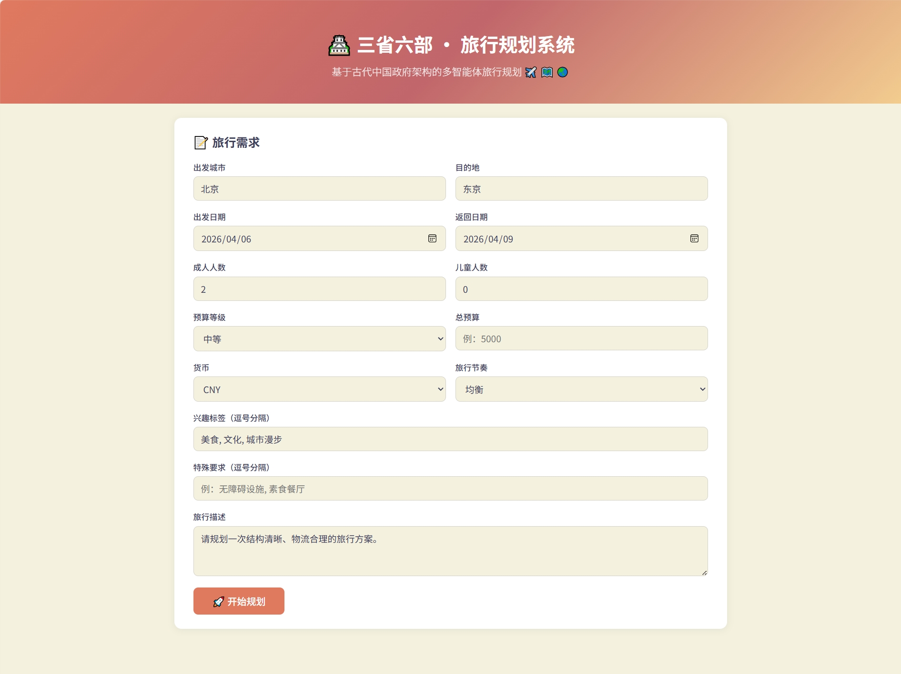
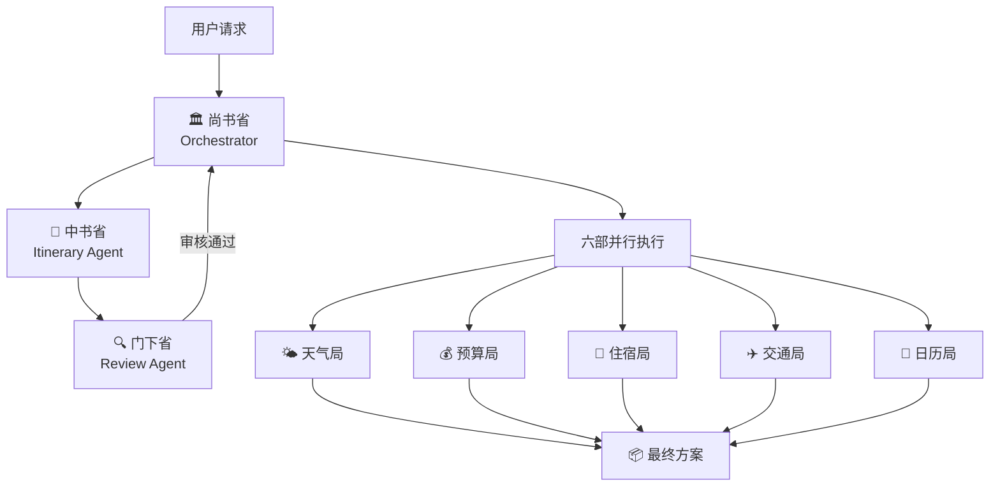

<div align="center">

# 🏛️ Multi-Agent Travel Planning System

**基于LangGraph的多智能体旅行规划系统 · 采用"三省六部"架构设计**

[](https://www.python.org/downloads/)
[](https://github.com/langchain-ai/langgraph)
[](https://fastapi.tiangolo.com/)
[](LICENSE)

[功能特性](#-功能特性) • [快速开始](#-快速开始) • [使用方法](#-使用方法) • [示例输出](#-示例输出) • [架构设计](#-架构设计)

</div>

---

## 📸 Web界面预览



实时可视化展示"三省六部"工作流执行进度，支持流式日志反馈和人工干预。

---

## ✨ 功能特性

- 🎨 **可视化Web界面** - 实时展示"三省六部"工作流执行进度
- 🤖 **智能行程规划** - 基于LangGraph的多智能体协作
- ✅ **多层审核机制** - 门下省审核确保方案质量
- 📡 **流式反馈** - Server-Sent Events实时推送进度日志
- 👤 **人工干预支持** - 在关键节点可介入调整
- 📄 **多格式输出** - Markdown旅行计划 + iCalendar日历文件

---

## 🏗️ 架构设计

### 三省六部体系



| 模块 | 职责 |
|------|------|
| **尚书省** | 总协调者,管理整体工作流,处理人工干预 |
| **中书省** | 起草行程方案,规划每日活动 |
| **门下省** | 审核方案质量,提出改进建议 |
| **天气局** | 查询目的地天气,生成装箱清单 |
| **预算局** | 计算费用明细,控制总预算 |
| **住宿局** | 推荐酒店选项,提供预订链接 |
| **交通局** | 查询航班信息,规划交通路线 |
| **日历局** | 生成iCalendar日历文件 |

---

## 🚀 快速开始

### 1. 安装依赖

```bash
# 克隆仓库
git clone https://github.com/bl16e/Multi-Agent-Travel-Planning-System.git
cd Multi-Agent-Travel-Planning-System

# 安装Python依赖
pip install -r requirements.txt
```

### 2. 配置环境变量

```bash
cp .env.example .env
```

编辑 `.env` 文件:

```env
QWEN_API_KEY=your_qwen_api_key
QWEN_MODEL=qwen-plus-2025-07-28
QWEN_BASE_URL=https://dashscope.aliyuncs.com/compatible-mode/v1
AMAP_API_KEY=your_amap_api_key
SERPAPI_API_KEY=your_serpapi_key
OUTPUT_DIR=artifacts
```

### 3. 启动服务

```bash
# Web界面 (推荐)
uvicorn main:app --reload

# 命令行演示
python main.py
```

访问 http://localhost:8000 开始使用!

---

## 📖 使用方法

### Web界面

1. 填写旅行需求表单(出发地、目的地、日期、预算等)
2. 点击"开始规划"按钮
3. 实时查看工作流执行进度
4. 查看完整旅行方案
5. 下载Markdown文件或iCalendar日历

### API调用

```python
import httpx

response = httpx.post("http://localhost:8000/plan", json={
    "request_id": "my_trip_001",
    "user_message": "规划一次东京之旅",
    "profile": {
        "origin_city": "北京",
        "destination_preferences": ["东京"],
        "start_date": "2026-04-18",
        "end_date": "2026-04-21",
        "adults": 2,
        "budget_level": "mid_range",
        "total_budget": 2000,
        "currency": "USD",
        "interests": ["美食", "文化", "城市漫步"],
        "pace": "balanced"
    }
})
```

---

## 📝 示例输出

查看完整示例: [东京旅行方案](docs/example-output.md)

### 行程概览

```markdown
### Day 1 - 2026-04-18 - 抵达与文化体验
- 09:00-12:30 浅草寺文化沉浸
- 15:30-16:45 隅田川游船
- 18:30-20:30 米其林寿司晚宴

### Day 2 - 2026-04-19 - 博物馆与美食
- 09:00-13:00 上野博物馆群
- 14:00-16:30 皇居东御苑
- 17:30-19:30 筑地市场美食巡礼
```

### 预算明细

| 类别 | 项目 | 费用 |
|------|------|------|
| 航班 | 北京-东京往返 | $640 |
| 住宿 | 3晚中档酒店 | $420 |
| 餐饮 | 所有餐食 | $525 |
| 交通 | 本地交通 | $397.5 |
| **总计** | | **$1,982.5** |

---

## 🗂️ 项目结构

```
project/
├── main.py                          # FastAPI应用入口
├── workflow.py                      # LangGraph工作流定义
├── interactive_demo.py              # 交互式演示
├── provinces/                       # 智能体模块
│   ├── shangshu_orchestrator/       # 尚书省
│   ├── zhongshu_itinerary/          # 中书省
│   ├── menxia_review/               # 门下省
│   └── liubu/                       # 六部
│       ├── weather/                 # 天气局
│       ├── budget/                  # 预算局
│       ├── accommodation/           # 住宿局
│       ├── flight_transport/        # 交通局
│       └── calendar/                # 日历局
├── utils/                           # 工具函数
│   ├── schemas.py                   # 数据模型
│   ├── llm_factory.py               # LLM工厂
│   └── markdown_formatter.py        # Markdown格式化
├── templates/                       # HTML模板
├── static/                          # 静态资源(CSS/JS)
├── tests/                           # 测试用例
└── artifacts/                       # 输出文件目录
```

---

## 🧪 开发与测试

```bash
# 运行测试
pytest

# 运行特定测试
pytest tests/test_workflow.py

# 查看测试覆盖率
pytest --cov=provinces --cov=utils
```

---

## 🔌 API端点

| 端点 | 方法 | 描述 |
|------|------|------|
| `/` | GET | Web界面首页 |
| `/health` | GET | 健康检查 |
| `/plan` | POST | 创建旅行计划 |
| `/plan/stream` | POST | 流式创建旅行计划(SSE) |
| `/resume/{request_id}` | POST | 恢复并继续规划 |
| `/resume/{request_id}/stream` | POST | 流式恢复规划 |
| `/dashboard/{request_id}` | GET | 查看规划状态 |
| `/download/{request_id}` | GET | 下载生成的文件 |

---

## 🛠️ 技术栈

- **框架**: FastAPI, LangGraph, LangChain
- **LLM**: 通义千问 (Qwen)
- **前端**: Vanilla JavaScript, Server-Sent Events
- **数据验证**: Pydantic
- **测试**: Pytest

---

## 📄 License

MIT License - 详见 [LICENSE](LICENSE) 文件

---

## 🙏 致谢

本项目灵感来源于"三省六部"架构 ("https://github.com/cft0808/edict.git"), 通过多智能体协作实现复杂的旅行规划任务。

---

<div align="center">

**⭐ 如果这个项目对你有帮助,请给个Star! ⭐**

</div>
